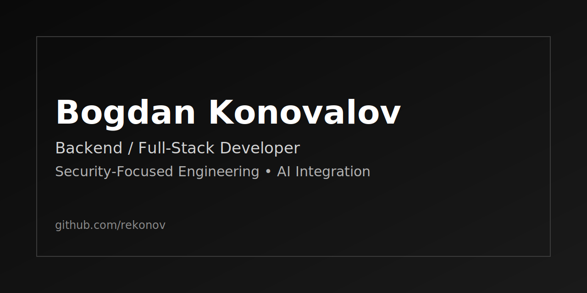

# Bogdan Konovalov

Backend and Full-Stack Developer focused on secure architecture and production delivery.
I build systems end-to-end: backend design, APIs, database layer, real-time features, deployment, and containerization.

## Expertise

- Backend: Node.js, REST API, WebSocket, JWT/session flows
- Frontend: TypeScript, React, Next.js
- Databases: PostgreSQL, MySQL, MongoDB
- Security: secure coding, threat modeling, attack surface reduction
- AI: LLM API integration, workflow automation, assistant logic
- Infrastructure: Docker, Linux, Git, containerized deployment

## Open To

- Part-time and freelance roles
- Full-Stack development (React / Next.js + Node.js backend)
- AI integration and automation tasks (LLM-powered product features)
- Security-focused engineering work (secure APIs, auth hardening, threat-aware architecture)

## Contact

- Telegram: [@reekonov](https://t.me/reekonov)
